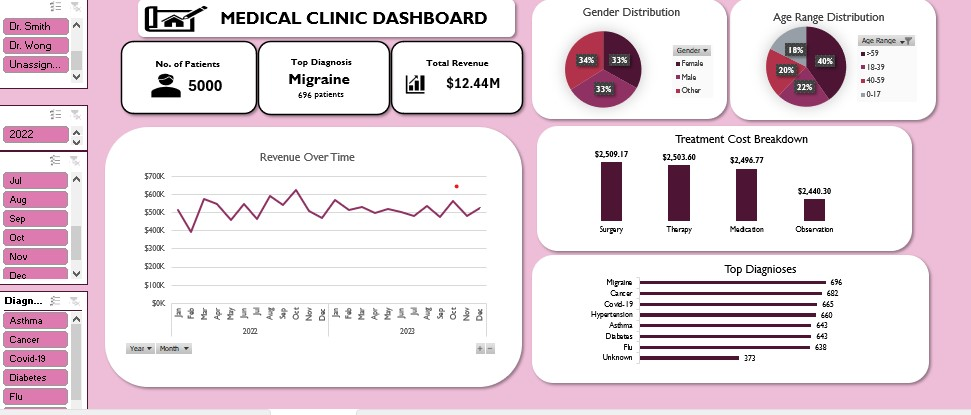

# Healthcare Clinic Performance Dashboard

## Overview
This project presents an interactive Excel dashboard designed to analyze clinic performance, patient demographics, disease trends, revenue patterns, and treatment costs.

The dashboard transforms raw healthcare data into clear business and operational insights using Excel-based analytics and visualization techniques.

---

# Tools Used
- Microsoft Excel
- Pivot Tables
- Pivot Charts
- Slicers & Interactive Filters
- KPI Cards
- Data Cleaning & Formatting

---

# Key Metrics

| Metric | Value |
|---|---|
| Total Patients | 5,000 |
| Total Revenue | $12.44M |
| Top Medical Condition | Migraine |
| Highest Cost Service | Surgery |

---

# Key Insights

## Clinical Trends
- Migraine recorded the highest patient volume with **696 patients**.
- Cancer and Covid-19 followed closely with:
  - **682 patients**
  - **665 patients**

---

## Revenue Analysis
- Monthly revenue remained relatively stable between **$400K–$600K**.
- Revenue peaks appeared in late 2022 and late 2023, suggesting seasonal healthcare demand patterns.

---

## Demographic Insights

### Gender Distribution
- Female: **34%**
- Male: **33%**
- Other: **33%**

### Age Distribution
- The largest patient groups were:
  - Ages **18–39**
  - Ages **40–59**

The clinic showed balanced patient representation across all age groups.

---

## Treatment Cost Breakdown
- Surgery had the highest average treatment cost (**$2,509.17**).
- Therapy and Medication followed closely behind.
- Observation was the lowest-cost treatment category.

---

# Dashboard Features
- Revenue trend analysis
- Disease prevalence tracking
- Patient demographic analysis
- Treatment cost comparison
- Interactive Excel visuals and KPI summaries

---

# Future Improvements
- Automated Excel reporting
- Predictive healthcare analysis
- Advanced patient segmentation
- Integration with SQL or Power BI for scalability

